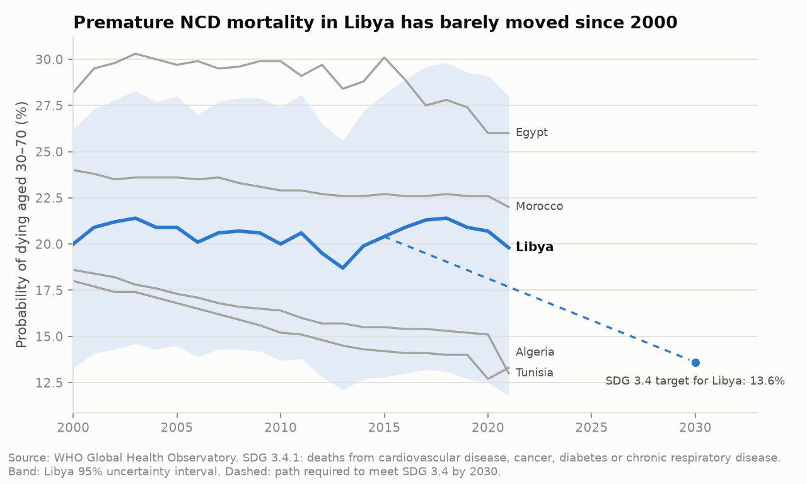
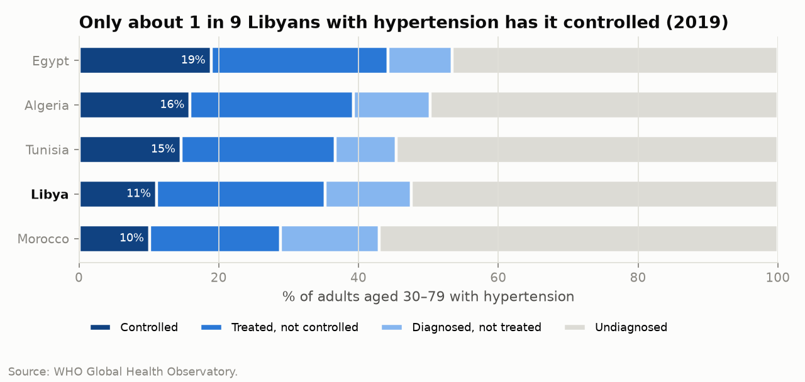
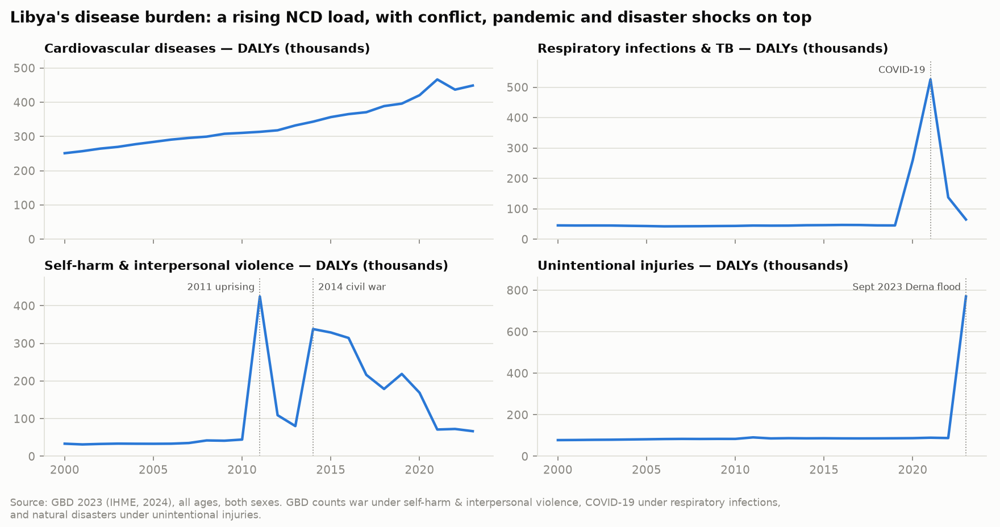
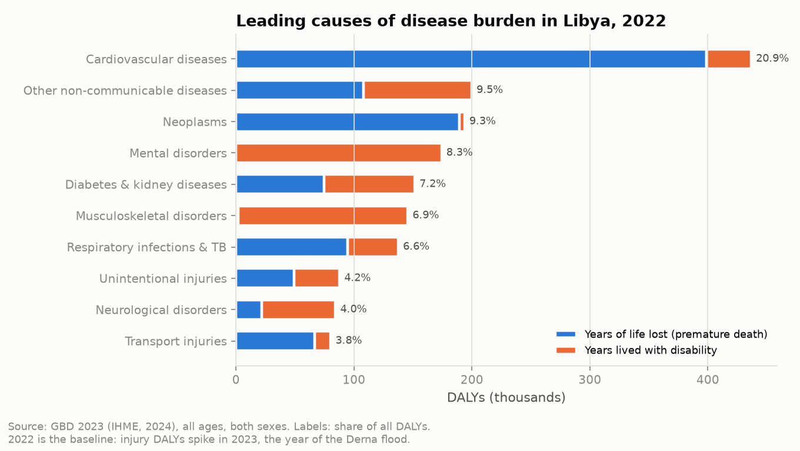
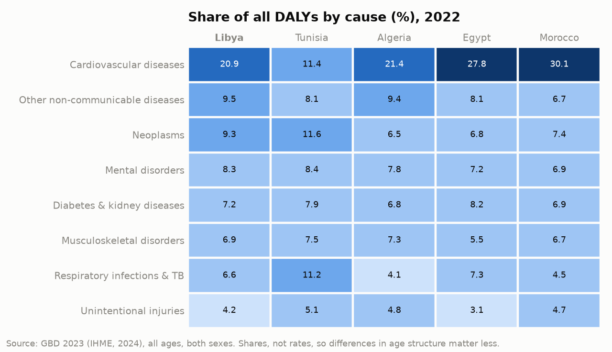
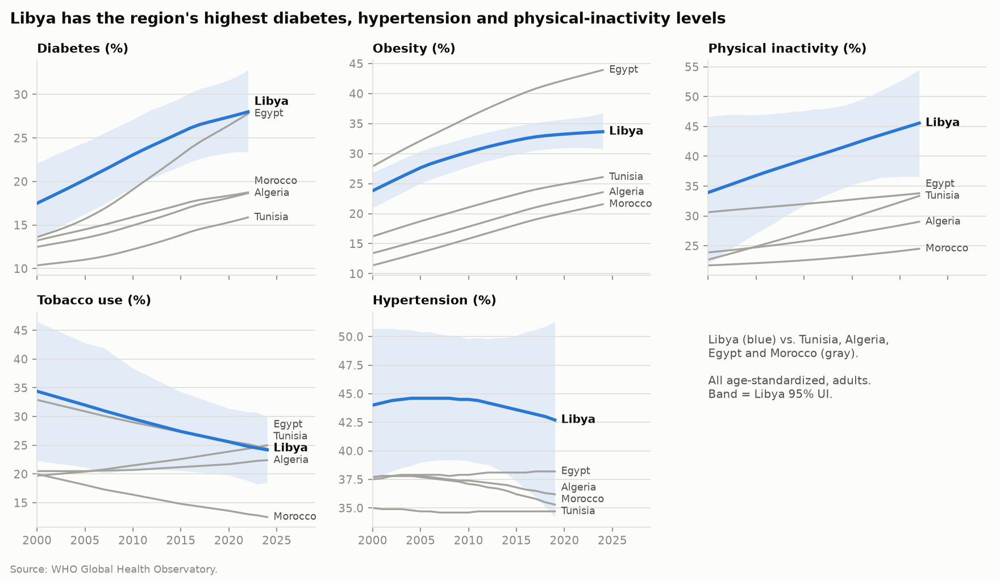
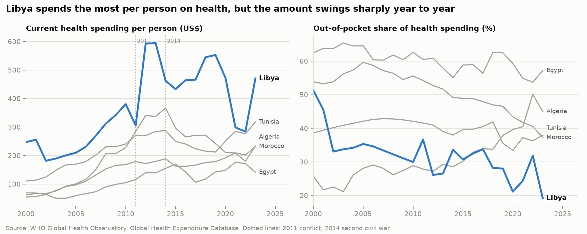
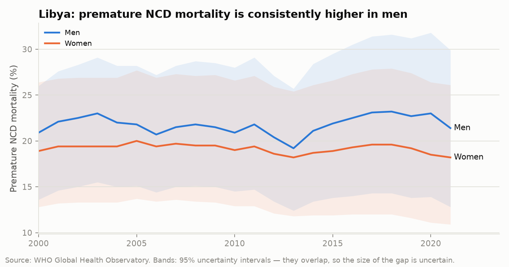
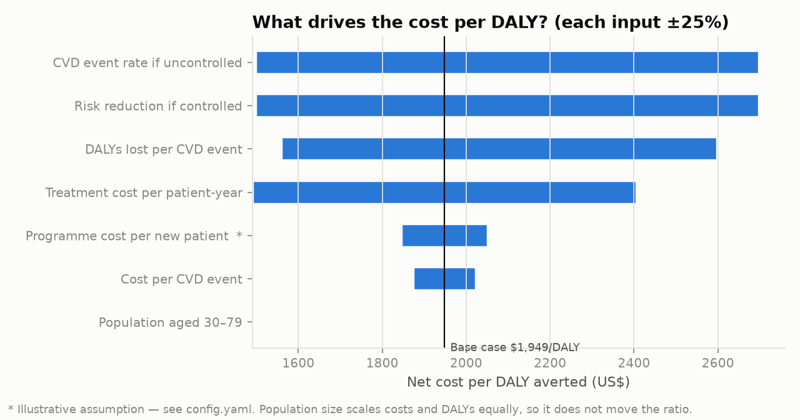
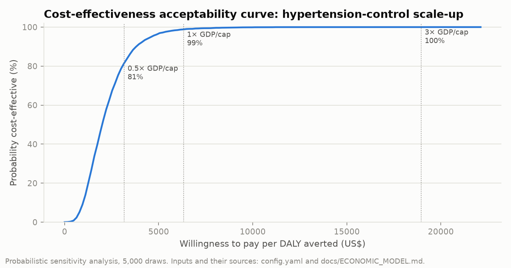

# 🇱🇾 Libya NCD Burden & Health-Financing Analysis

### Non-communicable disease burden, hypertension care cascade and health financing in Libya vs. North Africa (2000–2024), with a health-economic scenario model

[](https://github.com/natheerne-hub/libya-ncd-burden/actions/workflows/ci.yml)

**Dr. Nather Yunis Suliaman, MD** · Public-health data analysis · Python · reproducible research

📄 **Policy brief (2 pages):** [English PDF](docs/brief/policy_brief_en.pdf) · [PDF بالعربية](docs/brief/policy_brief_ar.pdf)

---

## Why this project

Non-communicable diseases (cardiovascular disease, diabetes, cancer, chronic respiratory disease) cause most
premature deaths in Libya. Yet Libya is rarely analysed on its own: it is often missing from regional
reports, and its data are shaped by conflict since 2011. This project uses public WHO data to answer
five policy questions about Libya and its four North African neighbours, and adds a transparent
health-economic model for one concrete intervention: **scaling up hypertension control**.

## Key findings

*From the committed WHO snapshot (extracted 24 Sep 2026). Every number is regenerated by the pipeline; the full auto-generated report is in [`outputs/RESULTS.md`](outputs/RESULTS.md).*

| | Finding |
|---|---|
| 🏥 **Burden (GBD 2023)** | Non-communicable diseases caused **76% of Libya's disease burden** in 2022. Cardiovascular disease is the leading cause (20.9% of DALYs, 91% of it from premature death), followed by other NCDs, cancers and mental disorders. On top of this rising NCD load come shocks: violence reached 21% of all DALYs in 2011, COVID-19 pushed respiratory infections to 21% in 2021, and injury DALYs rose almost 9× in 2023, the year of the Derna flood. |
| 📉 **SDG 3.4** | Premature NCD mortality was **19.8%** in 2021, almost unchanged from 20.0% in 2000. Meeting the 2030 target (13.6%) needs about −4.1% per year, but the observed trend since 2015 is −0.5% per year. **Not on track.** |
| ⚠️ **Risk factors** | Libya ranks **highest of the five countries** for diabetes (28.0%), hypertension (42.7%) and physical inactivity (45.6%), and second for obesity (33.7%). |
| 🩺 **Care cascade** | Of Libyans with hypertension, **52% are undiagnosed** and only **11%** have it controlled (2019). |
| 💰 **Financing** | Libya has the highest health spending per person in the group (US$470, 2023) and the lowest out-of-pocket share (19%), but per-capita spending is the most volatile (SD of year-on-year change ≈ 28% vs. 8–15% for neighbours). |
| 🧮 **Economics** *(preliminary)* | Raising hypertension control to 50% costs about **US$1,950 per DALY averted** (PSA median US$2,000; 95% UI 650–5,300), with a **99% probability of being cost-effective at 1× GDP per capita** (US$6,569, World Bank 2024; 83% at 0.5×). 6 of 7 inputs are sourced: WHO, UN WPP, GBD 2023, WHO HEARTS costing, the Ettehad 2016 meta-analysis and Moroccan cost-of-illness studies. |

<p align="center"></p>
<p align="center"></p>
<p align="center"></p>

<details><summary><b>More figures</b></summary>








</details>

## Research questions

1. Is Libya on track for **SDG 3.4**, and how does it compare with Tunisia, Algeria, Egypt and Morocco?
2. Which **modifiable risk factors** are most elevated in Libya?
3. Where do people with hypertension **drop out of care**?
4. How much does Libya **spend on health**, who pays, and how stable is the spending?
5. What would **hypertension-control scale-up** cost per DALY averted, and how uncertain is that estimate?

Methods, comparator choice and limitations: [`docs/ANALYSIS_PLAN.md`](docs/ANALYSIS_PLAN.md) ·
Economic model and parameter status: [`docs/ECONOMIC_MODEL.md`](docs/ECONOMIC_MODEL.md)

## Methods at a glance

| Layer | What it does |
|---|---|
| **Data** | 13 WHO Global Health Observatory indicators via the OData API; version-controlled snapshot plus a `--fetch` refresh; schema, range and uncertainty-interval checks on every run |
| **Epidemiology** | Log-linear average annual rate of change, SDG 3.4 required-vs-observed pace, regional ranking, sex-disaggregated trends with 95% uncertainty intervals |
| **Health systems** | Hypertension care cascade; financing level, composition (government vs. out-of-pocket) and volatility |
| **Health economics** | Cohort cost-effectiveness model, one-way sensitivity (tornado), probabilistic sensitivity analysis (5,000 draws, WHO uncertainty propagated), cost-effectiveness acceptability curve |
| **GBD 2023** | Level-2 causes for Libya (2000–2023) and neighbours (2022): leading causes, YLL/YLD split, cross-country shares, conflict and disaster shocks. IHD + stroke incidence and DALYs → CVD event rate and DALYs per event for the economic model |
| **Engineering** | Config-driven, 21 unit tests (including a hand-calculated check of the economic model), GitHub Actions CI that fails if committed results are stale |

## Reproduce

```bash
pip install -r requirements.txt
pytest -q                          # 21 tests
python run_pipeline.py             # snapshot → tables, figures, outputs/RESULTS.md
python run_pipeline.py --fetch     # refresh from the WHO API first
```

## Repository structure

```
├── config.yaml                 # countries, indicators, SDG settings, economic parameters (with source status)
├── run_pipeline.py
├── src/libya_ncd/
│   ├── data.py                 # WHO GHO API client, tidying, validation
│   ├── metrics.py              # AARC, SDG 3.4, cascade, financing
│   ├── economics.py            # cost-effectiveness model, OWSA, PSA, CEAC
│   ├── gbd.py                  # optional GBD module
│   ├── plots.py                # figures
│   └── report.py               # writes outputs/RESULTS.md
├── data/  snapshot/ · raw/ · external/  (see data/README.md)
├── outputs/  figures/ · tables/ · RESULTS.md · results.json
├── docs/  ANALYSIS_PLAN.md · ECONOMIC_MODEL.md · ROADMAP.md · brief/ (policy brief, EN + AR)
└── tests/
```

## Limitations

WHO NCD estimates for Libya are **modelled** from limited survey data, so the uncertainty intervals are wide.
Comparisons between countries are ecological. Figures from conflict years need careful interpretation.
The economic model still has **1 placeholder input** and 2 stated assumptions inside its GBD derivation, so its results are preliminary.
Full list: [`docs/ANALYSIS_PLAN.md`](docs/ANALYSIS_PLAN.md#limitations-to-state-in-any-write-up).

## Data & licence

Data: [WHO Global Health Observatory](https://www.who.int/data/gho) (subject to WHO terms) and GBD 2023 (Global Burden of Disease Collaborative Network, IHME 2024; aggregate extracts only). Code: MIT.
